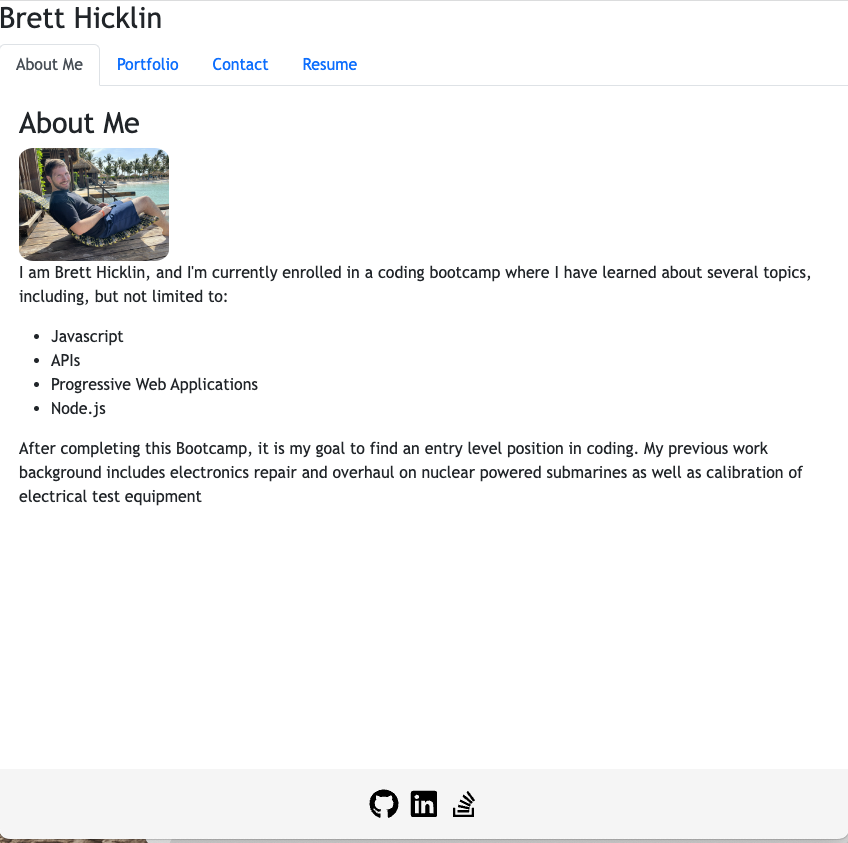
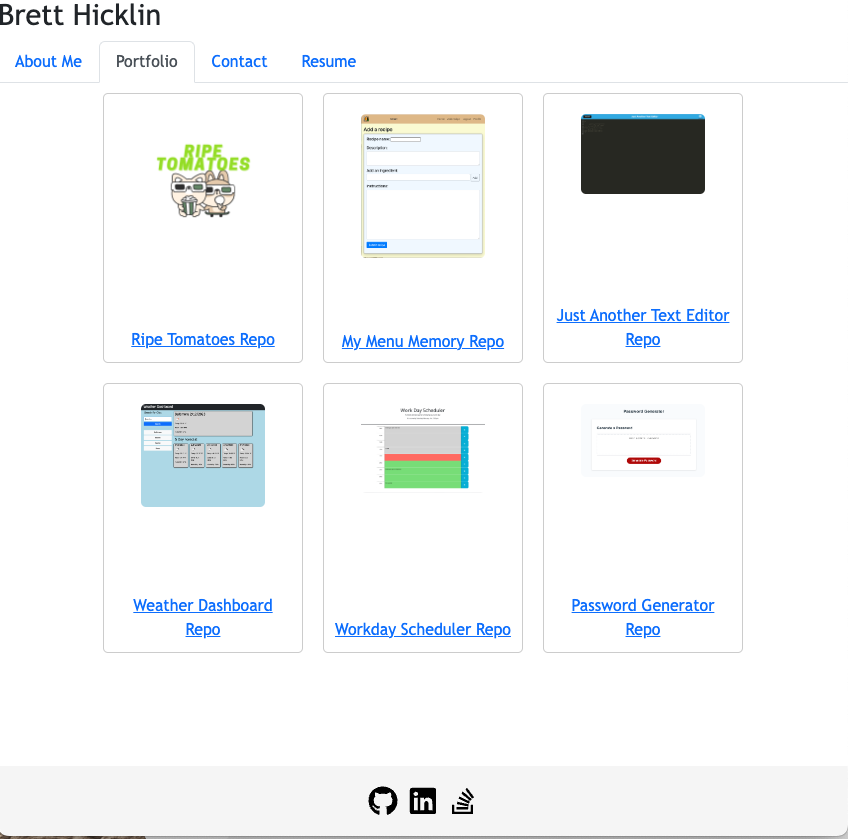
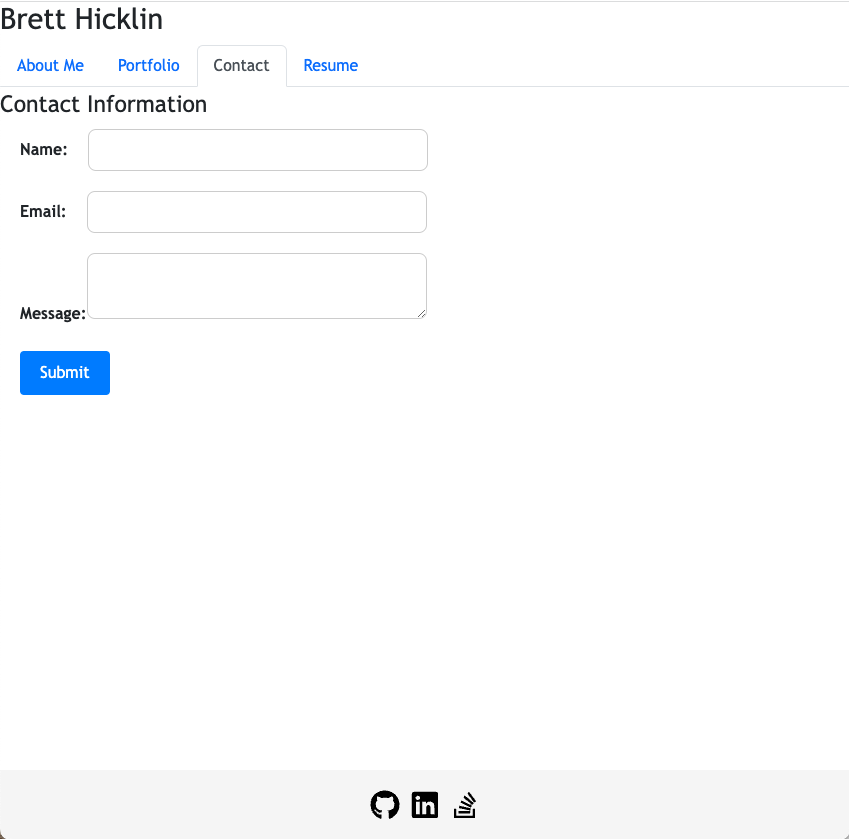
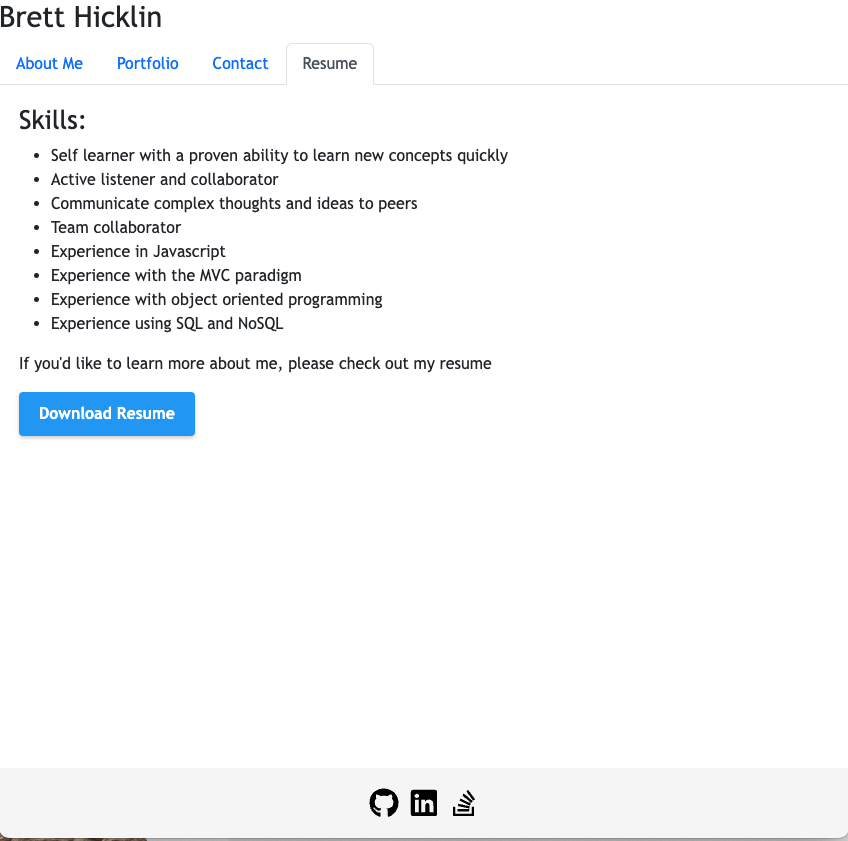

# <Updated Portfolio>

## Description

In this assignment, I updated my portfolio using React. Using React, my portfolio now looks cleaner, more professional and modern. Using React, I was able to separate the diffent sections of the website into reusable sections like the header and footer, while only modifying the content in the being displayed depending on which section was being viewed. 


## Installation

If the repo was downloaded, run
```
npm install
```

## Usage

To view locally, run 
```
npm start
```

To view the Github Pages link, you can visit [Brett Hicklin's Portfolio](https://brett-hicklin.github.io/updated-portfolio/)

 Here are some screenshots of my portfolio website, hosted on Github Pages
   




  
