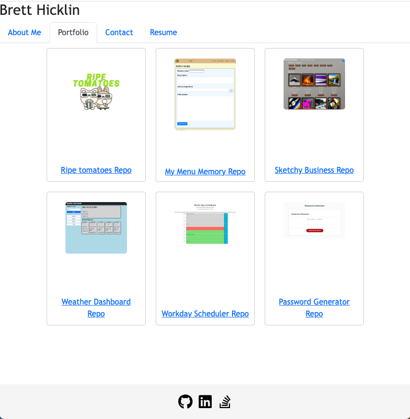

# <Updated Portfolio>

## Description

In this assignment, I updated my portfolio using React. Using React, my portfolio now looks cleaner, more professional and modern. With React, I was able to separate the different sections of the website into reusable sections like the header and footer, which won't need to change from section to section. I therefore only was modifying the content in the body.


## Installation

If the repo was downloaded, run
```
npm install
```

## Usage

To view locally, run 
```
npm start
```

To view the Github Pages link, you can visit [Brett Hicklin's Portfolio](https://brett-hicklin.github.io/updated-portfolio/)

 Here are some screenshots of my portfolio website, hosted on Github Pages
   




  
